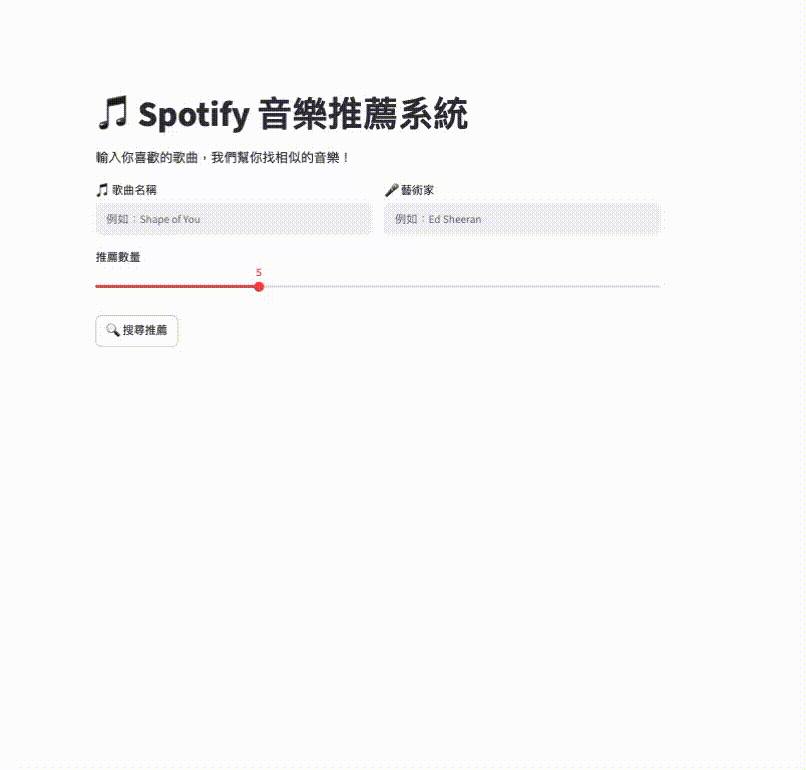

# 🎵 Spotify Music Recommender System

A content-based music recommendation system built with Python, scikit-learn, and OpenAI GPT — with an interactive Streamlit web interface.

---

## 🎬 Live Demo



---

## ✨ Features

- 🔍 **Song Search** — Search any song by name and artist
- 🎯 **Smart Recommendations** — Find similar songs using Cosine Similarity
- 🤖 **AI Explanations** — GPT-powered explanations of why each song is recommended
- 🎛️ **Adjustable Results** — Choose how many recommendations you want (3-10)

---

## 🏗️ System Architecture

```
Input Song
    ↓
Content-Based Filtering
(Cosine Similarity on audio features)
    ↓
Top N Similar Songs
    ↓
OpenAI GPT Explanation Layer
    ↓
Streamlit Web Interface
```

---

## 🛠️ Tech Stack

| Technology           | Purpose                                |
| -------------------- | -------------------------------------- |
| `pandas` / `numpy`   | Data cleaning and processing           |
| `scikit-learn`       | StandardScaler, Cosine Similarity      |
| `OpenAI GPT-4o-mini` | AI-powered recommendation explanations |
| `Streamlit`          | Web interface                          |
| `Python 3.10+`       | Core language                          |

---

## 📊 Dataset

**Spotify Tracks Dataset** from Kaggle

- 113,241 songs across 114 genres
- 9 audio features used for similarity calculation:
  - `danceability`, `energy`, `loudness`, `speechiness`
  - `acousticness`, `instrumentalness`, `liveness`, `valence`, `tempo`

---

## 🧹 Data Cleaning

- Removed 1 row with missing artist/track/album names
- Removed 603 tracks longer than 10 minutes (likely podcasts/audiobooks)
- Removed 157 tracks with 0 BPM (invalid data)
- Applied `StandardScaler` to normalize all audio features

---

## 🤖 How It Works

### 1. Feature Extraction

Audio features are extracted from the dataset for each song.

### 2. Normalization

`StandardScaler` normalizes all features to the same scale — preventing high-range features like `tempo` (0-243) from dominating similarity calculations over features like `danceability` (0-1).

### 3. Cosine Similarity (On-demand)

Instead of pre-computing a full similarity matrix (which would require ~100GB of RAM), similarity is computed **on-demand** — only when a user queries a song.

### 4. GenAI Layer

The top 3 recommendations are passed to OpenAI GPT-4o-mini, which generates natural language explanations of why each song was recommended.

---

## ⚙️ Setup & Installation

### 1. Clone the repository

```bash
git clone https://github.com/Rita-Ning/spotify-recommender.git
cd spotify-recommender
```

### 2. Install dependencies

```bash
pip install -r requirements.txt
```

### 3. Download the dataset

Download from [Kaggle](https://www.kaggle.com/datasets/maharshipandya/-spotify-tracks-dataset) and place `dataset.csv` in the project root.

### 4. Set up your API Key

Create a `.env` file in the project root:

```
OPENAI_API_KEY=sk-...
```

### 5. Run the app

```bash
streamlit run app.py
```

---

## 📁 Project Structure

```
spotify-recommender/
│
├── app.py              # Main Streamlit application
├── notebook.ipynb      # Exploratory Data Analysis
├── requirements.txt    # Python dependencies
├── .env                # API Key (not uploaded to GitHub)
├── .gitignore          # Git ignore rules
└── README.md           # This file
```

---

## ⚠️ Known Limitations

- **Cold Start Problem** — Can only recommend songs within the dataset (113,241 songs). Songs not in the dataset cannot be queried.
- **Dataset Age** — Dataset was collected in 2022. Newer songs may not be available.
- **Duplicate Tracks** — Same song may appear in multiple genres in the dataset; duplicates are filtered in recommendations.

---

## 💡 Future Improvements

- [ ] Integrate Spotify API to support any song query
- [ ] Add user preference history
- [ ] Deploy to Streamlit Cloud
- [ ] Add genre filtering option

---

## 👨‍💻 Author

Built as a learning project to understand:

- Content-Based Filtering
- Cosine Similarity
- GenAI integration with traditional ML systems
- End-to-end ML application development

---

## 📄 License

MIT License
